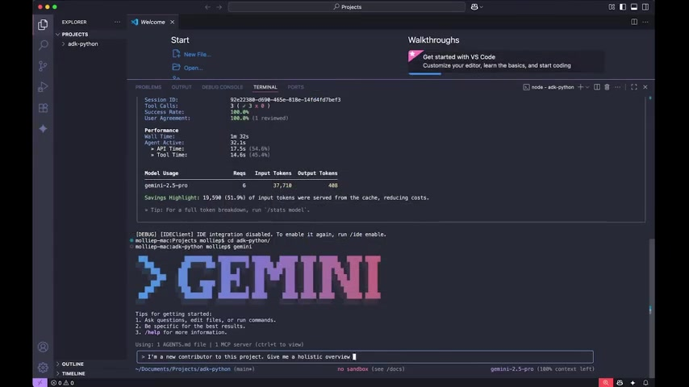

# Deep Dive into Gemini CLI: From Origin Story to Future Roadmap

**By Molly Pettit**

Welcome back to *The Agent Factory*! In our latest episode, Emmett and I had the absolute pleasure of sitting down with Taylor Mullen, the creator of the Gemini CLI. We dove deep into the philosophy behind the tool, its surprising origin story, and what the future holds for this powerful AI agent that lives right in your terminal.

## The Origin Story: Timing is Everything

One of the most fascinating things Taylor shared was that the Gemini CLI actually started as an experiment about a year and a half ago—which, in AI time, feels like a decade!

Back then, he was experimenting with multi-agent systems. He built a prototype CLI, but it had some major hurdles:
*   **Latency:** A single user request could trigger 30 LLM calls behind the scenes, taking over a minute and a half to respond.
*   **Cost:** It was expensive to run.
*   **Context:** Models had limited context windows.

They actually scrapped the project because it felt "too early." But fast forward to today, and the developer ecosystem has shifted. CLIs are back in vogue, models are faster and cheaper, and the context windows (like Gemini's 1 million tokens) are massive. Taylor went "dark" for a week, built a new prototype, and the rest is history.

## Open Source by Design

We asked Taylor why he decided to make Gemini CLI open source. For him, coming from a developer tooling background, it was a no-brainer—but it's also about **trust**.

When an AI agent is running on your machine, reading your files, and executing commands, you need to know exactly what it's doing. By open-sourcing it, the community can audit the code, ensure security, and even contribute.

Taylor mentioned that the team—and the community—ships around **100 to 150 features, bugs, and enhancements every single week**. That velocity is possible because they actually use the Gemini CLI to build the Gemini CLI. It's the ultimate "dogfooding" experience.

## "Do What a Person Would Do"

One of my favorite takeaways from the interview was Taylor's explanation of how the CLI "thinks." unlike many other tools, Gemini CLI **does not use embeddings** to index your codebase.

Instead, it follows a philosophy of: **"Do what a person would do."**

If you ask it a question about your code, it doesn't look up a vector database. It effectively "greps" through your files, opens them, reads them, and follows references—just like a human developer would when onboarding onto a new codebase. This approach helps ground the LLM in the actual reality of your project, reducing hallucinations and improving context.

## Self-Healing and "Scrappy" Solutions

During the episode, Emmett showed off a great demo of onboarding onto the Google ADK repo.

What's really cool is the CLI's ability to **"self-heal."** If it tries a command and fails, it analyzes the error, figures out a fix, and asks if it can proceed. Taylor shared a story where he asked the CLI to share a demo with the marketing team. Since there was no "deploy" button yet, the CLI got scrappy: it created a GitHub repository, set up GitHub Pages, pushed the content, and gave him a live link.

It’s that kind of agentic behavior—reasoning, tool use, and adaptability—that makes it feel like a real pair programmer.

## The Future: Extensions Everywhere

So, what's next? **Extensions.**

Taylor revealed that the team is doubling down on extensibility. Soon, you'll be able to install extensions (like the upcoming Cloud Run extension) to customize the CLI for your specific workflow—whether you're a Go developer, a marketer, or a content creator. The goal is to make Gemini CLI the universal interface for any task.

If you haven't tried it yet, check out [Google Gemini CLI on GitHub](https://github.com/google-gemini/gemini-cli).

---
*Catch the full episode of The Agent Factory for more demos and insights!*
